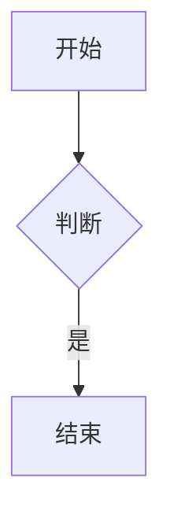
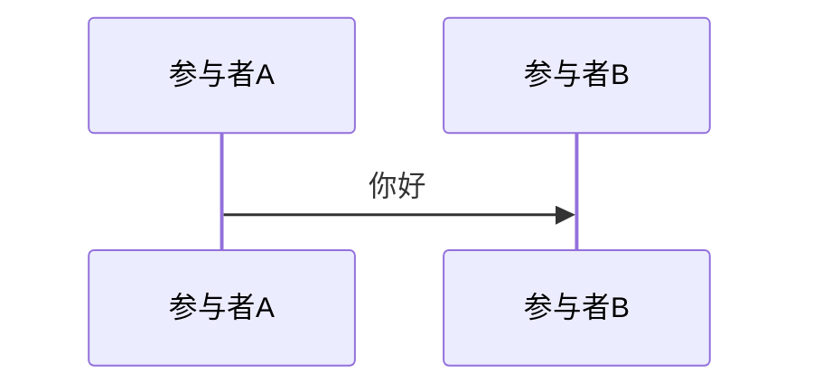
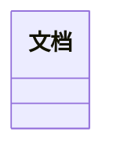
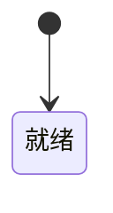
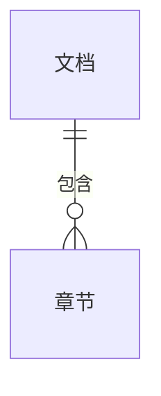
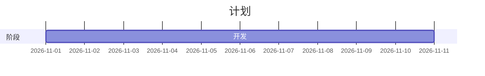
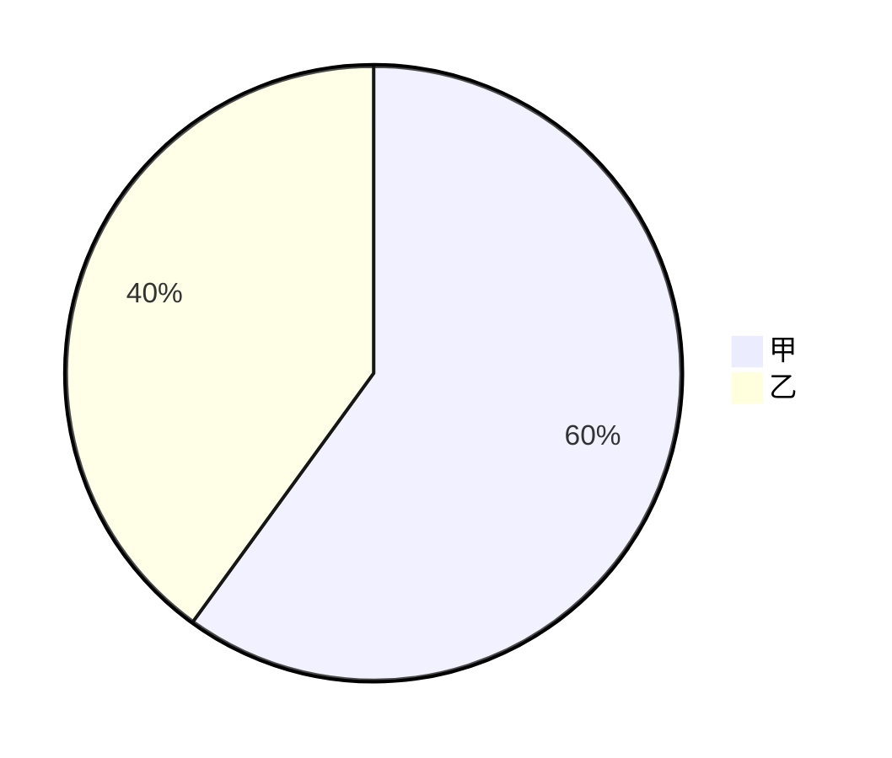
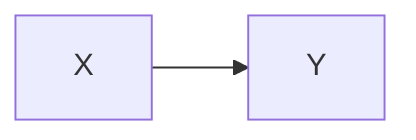

# 图表

```mermaid
flowchart TD
  A[开始] --> B{判断}
  B -->|是| C[结束]
```

```mermaid
sequenceDiagram
  参与者A->>参与者B: 你好
```

```mermaid
classDiagram
  class 文档
```

```mermaid
stateDiagram-v2
  [*] --> 就绪
```

```mermaid
erDiagram
  文档 ||--o{ 章节 : 包含
```

```mermaid
gantt
  title 计划
  dateFormat YYYY-MM-DD
  section 阶段
  开发 :a1, 2026-11-01, 10d
```

```mermaid
pie
  "甲" : 60
  "乙" : 40
```

```mermaid
%%{init: {"securityLevel": "loose"}}%%
flowchart LR
  X --> Y
```
